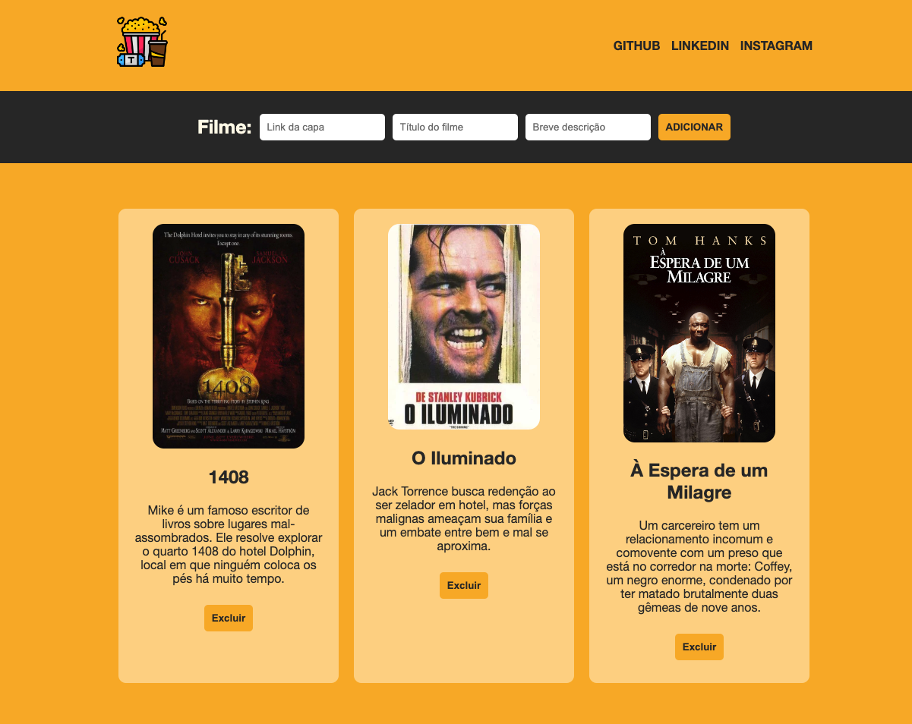

# Filmes Favoritos

## 💻 Projeto

Descrição: Criei uma aplicação que permite ao usuário adicionar e remover filmes de uma lista de filmes favoritos utilizando o localStorage para persistir os dados.

O resultado da aplicação pode ser acessado através da seguinte URL: [Filmes Favoritos](https://meus-filmes-favoritos.netlify.app/)

## 🎨 Layout

## 👩‍💻 Habilidades Desenvolvidas neste projeto

**Manipulação do DOM**: Criar, modificar e remover elementos HTML usando JavaScript para atualizar dinamicamente a página.

**Uso de Event Listeners**: Utilizar event listeners para responder a eventos do usuário, como clicar em botões, para realizar ações específicas.

**Armazenamento Local (localStorage)**: Implementar a funcionalidade de armazenar dados localmente no navegador do usuário usando o localStorage para manter um registro dos filmes favoritos mesmo após o fechamento do navegador.

**Trabalho com Formulários**: Criar um formulário para coletar informações dos filmes, validando os campos e adicionando filmes à lista.

**Estilização com CSS**: Desenvolver uma folha de estilos CSS para tornar a aplicação mais atraente e responsiva.

**Flexbox**: Usar o CSS Flexbox para criar layouts flexíveis, tornando a aplicação amigável para dispositivos de diferentes tamanhos de tela.

**Manipulação de Arrays**: Manipular arrays para adicionar e remover filmes da lista, utilizando métodos como push e filter para atualizar o estado da aplicação.

**Boas Práticas de JavaScript**: Escrever código JavaScript limpo e organizado, seguindo as melhores práticas.

**Boas Práticas de HTML/CSS**: Criar um HTML semântico e uma folha de estilos CSS bem estruturada.

**Responsividade**: Tornar a aplicação responsiva, adaptando-a para diferentes tamanhos de tela por meio de media queries.

**Manipulação de Imagens**: Exibir imagens dos filmes na página da web.

**Validação de Entrada do Usuário**: Implementar validações de entrada para garantir que os campos não fiquem em branco.

## 📝 Requisitos Funcionais

**1. Formulário de Inserção de Filmes**:
Deve haver um formulário com campos para inserir informações sobre um filme: link da capa, título do filme e breve descrição.
O campo "Link da Capa" deve permitir a inserção de URLs de imagens.

**2. Botão de Adicionar**:
Deve haver um botão que permita adicionar um filme à lista quando o formulário estiver preenchido.

**3. Lista de Filmes Favoritos**:
Uma lista de filmes favoritos deve ser exibida na página.

**4. Exibição de Filmes**:
Cada filme na lista deve ser exibido como um elemento com a capa do filme, título e descrição.

**5. Botão de Excluir Filme**:
Cada filme na lista deve ter um botão "Excluir" que permita removê-lo da lista.

**6. Armazenamento Local (localStorage)**:
Os filmes favoritos adicionados à lista devem ser armazenados localmente no navegador usando o localStorage. Isso deve permitir que os filmes persistam mesmo após o fechamento do navegador.

**7. Responsividade**:
A aplicação deve ser responsiva e adaptar-se a diferentes tamanhos de tela usando media queries.

## 📝 Requisitos de Estilo:

**1. Estilo Geral**:
O estilo geral da aplicação deve ser atraente e consistente.
Use uma paleta de cores que seja esteticamente agradável.

**2. Formulário e Botão**:
O formulário e o botão "Adicionar" devem ter uma aparência agradável e serem facilmente identificáveis.

**3. Lista de Filmes**:
Os filmes na lista devem ser exibidos de maneira organizada e legível.
Use margens, espaçamento e cores de fundo apropriados para separar os elementos da lista.

**4. Imagens dos Filmes**:
As imagens dos filmes devem ser exibidas com uma largura fixa e ter uma borda arredondada ou algum estilo adicional para melhorar a apresentação.

**5. Links de Redes Sociais**:
Se houver links para redes sociais no cabeçalho (GitHub, LinkedIn, Instagram), eles devem ter uma aparência atraente e estar acessíveis.

## 📝 Requisitos de Comportamento:
1. Validação de Entrada:
Deve haver validação de entrada para garantir que os campos do formulário não fiquem em branco.

**2. Adicionar Filmes**:
O botão "Adicionar" deve adicionar um filme à lista quando os campos do formulário estiverem preenchidos corretamente.

**3. Excluir Filmes**:
O botão "Excluir" deve remover um filme da lista quando pressionado.

**4. Armazenamento Local**:
Os filmes favoritos adicionados devem ser armazenados corretamente no localStorage para que possam ser recuperados quando a página for recarregada.
