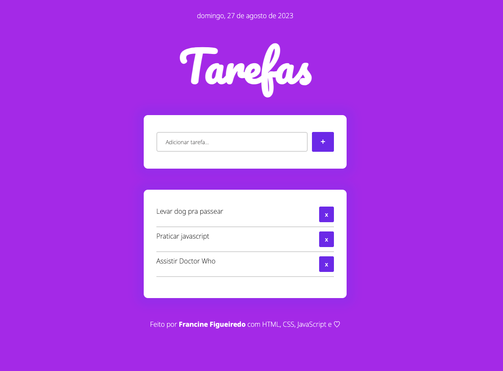
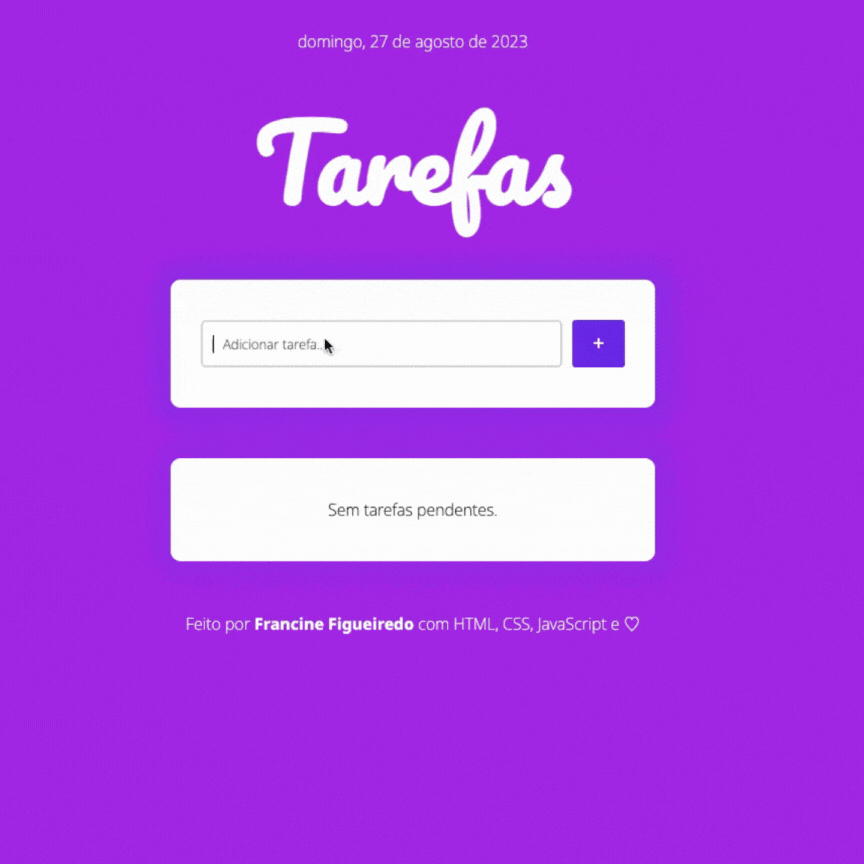

<h1 align="center">
  TAREFAS ✏️
</h1>

<h3 align="center">
  HTML | CSS | Javascript
</h3>

  <a href="#bookmark-sobre">Sobre</a>&nbsp;&nbsp;&nbsp;|&nbsp;&nbsp;&nbsp;
  <a href="#computer-habilidades">Habilidades</a>&nbsp;&nbsp;&nbsp;|&nbsp;&nbsp;&nbsp;
  <a href="#rocket-tecnologias">Tecnologias</a>&nbsp;&nbsp;&nbsp;|&nbsp;&nbsp;&nbsp;
  <a href="https://deploy-lista-de-tarefas.netlify.app/" target="_blank">Aplicação na Netlify</a>

  

## :bookmark: Sobre

A **Tarefas** é uma aplicação que permite ao usuário adicionar e remover tarefas.

  

## :computer: Habilidades

**Manipulação do DOM**: Criar, modificar e remover elementos HTML usando JavaScript para atualizar dinamicamente a página.

**Uso de Event Listeners**: Utilizar event listeners para responder a eventos do usuário, como clicar em botões, para realizar ações específicas.

**Armazenamento Local (localStorage)**: Implementar a funcionalidade de armazenar dados localmente no navegador do usuário usando o localStorage para manter um registro das tarefas mesmo após o fechamento do navegador.

**Trabalho com Formulários**: Criar um formulário para coletar a tarefa digitada, validando os campos e adicionando a tarefa à lista.

**Estilização com CSS**: Desenvolver uma folha de estilos CSS para tornar a aplicação mais atraente e responsiva.

**Flexbox**: Usar o CSS Flexbox para criar layouts flexíveis, tornando a aplicação amigável para dispositivos de diferentes tamanhos de tela.

**Manipulação de Arrays**: Manipular arrays para adicionar e remover tarefas da lista, utilizando métodos como push para atualizar o estado da aplicação.

**Boas Práticas de JavaScript**: Escrever código JavaScript limpo e organizado, seguindo as melhores práticas.

**Boas Práticas de HTML/CSS**: Criar um HTML semântico e uma folha de estilos CSS bem estruturada.

## :rocket: Tecnologias

  - `HTML (HyperText Markup Language)`
  > O HTML é a linguagem de marcação usada para estruturar o conteúdo da página da web. Ele define elementos e tags que representam diferentes tipos de conteúdo, como texto, imagens, formulários e links.
  - `CSS (Cascading Style Sheets)`
  > O CSS é usado para estilizar páginas da web e controlar a apresentação visual do conteúdo HTML. Ele define regras de estilo, como cores, fontes, margens e espaçamento.
  - `JavaScript`
  > O JavaScript é uma linguagem de programação de alto nível usada para adicionar interatividade e funcionalidade a páginas da web. No projeto "Lista de Tarefas", o JavaScript é usado para adicionar e remover tarefas da lista, armazenar tarefas no localStorage e manipular eventos do usuário.
  - `localStorage`
  > O localStorage é uma API do navegador que permite armazenar dados localmente no dispositivo do usuário. É usado no projeto para armazenar a lista de tarefas, garantindo que os dados persistam mesmo após o fechamento do navegador.
 - `Netlify`
  > O Netlify é uma plataforma de hospedagem e implantação para sites e aplicativos da web, oferecendo integração contínua, hospedagem de alto desempenho, certificados SSL gratuitos e implantação automática a partir de repositórios Git. É usado para disponibilizar projetos web na internet.
